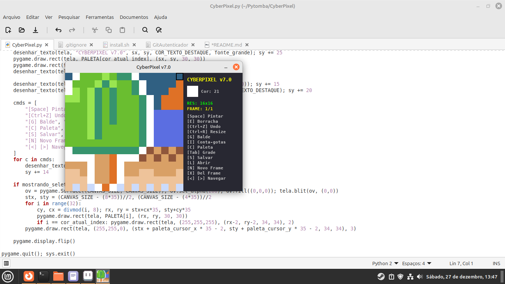
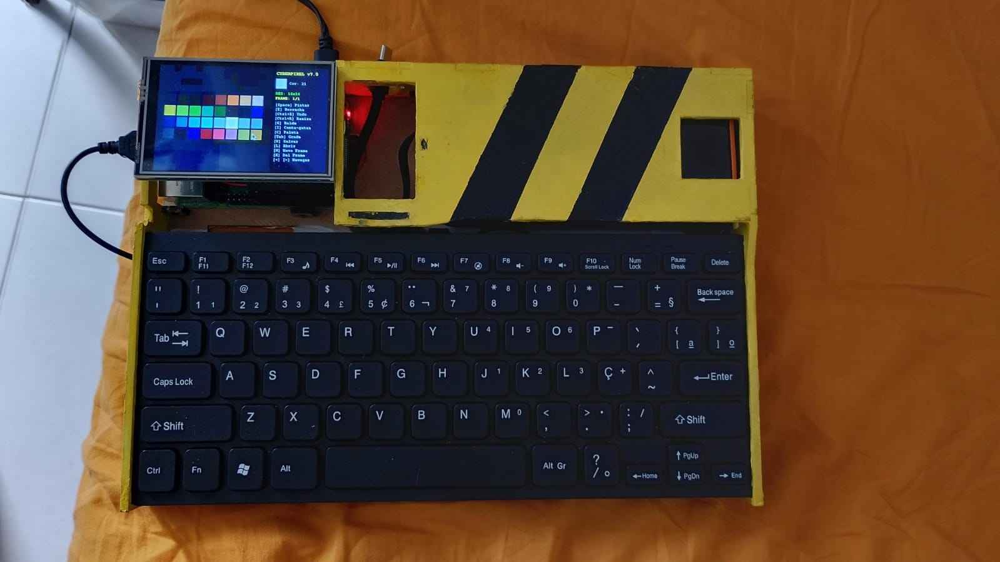

# 🎨 CyberPixel


**CyberPixel** is a lightweight, keyboard-centric pixel art and animation tool designed specifically for **Cyberdecks**, Raspberry Pi screens (3.5" TFT), and retro hardware enthusiasts.

It features a custom GUI optimized for 480x320 resolution, a curated DB32 color palette, and a workflow that keeps your hands on the keyboard.

---

## ✨ Features (v7.1)

* **Cyberdeck Ready:** Interface optimized for small screens (320x320 canvas + sidebar).
* **Transparency Support:** Full Alpha Channel support with checkerboard background visualization.
* **Animation:** Create, edit, and preview animations. Imports/Exports **GIFs** automatically.
* **Smart Tools:** Pencil, Eraser (Transparency), Flood Fill, and Eyedropper.
* **Dynamic Resolution:** Start with 16x16 and resize to 32x32, 64x64, or 128x128 on the fly (`Ctrl+R`).
* **Professional Workflow:** Unlimited Undo/Redo (`Ctrl+Z`) and Grid toggle.
* **Export:** Saves as **PNG** with transparency or **GIF** animation.

---

## 📸 Screenshots


*Running on Linux Mint*


*Running on custom Raspberry Pi Cyberdeck*

---

## 🚀 Installation (Raspberry Pi & Linux)

CyberPixel requires a virtual environment to run correctly on modern Linux distributions (like Raspberry Pi OS Bookworm) to avoid conflicts with system packages.

### 1. System Dependencies
First, install the required system libraries (Git and Tkinter for the GUI):

```bash
sudo apt-get update
sudo apt-get install python3-tk python3-venv git

```

### 2. Clone & Setup

Clone the repository and set up the Python virtual environment:

```bash
# Clone the repo
git clone https://github.com/Macamandi/CyberPixel.git
cd CyberPixel

# Create virtual environment
python3 -m venv venv

# Activate it
source venv/bin/activate

```

### 3. Install Python Libraries

With the environment activated `(venv)`, install the project dependencies:

```bash
pip install -r requirements.txt

```

### 4. Desktop Shortcut (Optional)

To add CyberPixel to your system menu (Graphics category), run the included script:

```bash
chmod +x install.sh
./install.sh

```

---

## ▶️ How to Run

**Option 1: Desktop Menu**
Find **CyberPixel** in your System Menu under **Graphics**.

**Option 2: Terminal**

```bash
cd CyberPixel
source venv/bin/activate
python CyberPixel.py

```

---

## 🎹 Controls & Shortcuts

CyberPixel is designed to be used with a keyboard.

| Category | Key | Action |
| --- | --- | --- |
| **Tools** | `Space` | Paint Pixel |
|  | `E` | Eraser (Make Transparent) |
|  | `G` | Flood Fill (Bucket) |
|  | `I` | Eyedropper (Pick Color) |
| **Navigation** | `Arrows` | Move Cursor |
|  | `Ctrl` + `Arrows` | Shift Canvas (Move Image) |
| **System** | `S` | Save (PNG with Alpha or GIF) |
|  | `L` | Load Image / Open GIF |
|  | `Ctrl` + `R` | Resize Canvas (e.g., 16 to 32) |
|  | `Ctrl` + `Z` | Undo |
|  | `Tab` | Toggle Grid |
| **Animation** | `N` | New Frame |
|  | `X` | Delete Current Frame |
|  | `<` and `>` | Previous / Next Frame |
| **Palette** | `C` | Open Color Selector |

---

## 🛠️ Tech Stack

* **Language:** Python 3
* **Engine:** Pygame
* **GUI:** Custom drawn + Tkinter (File Dialogs)
* **Architecture:** Venv-based execution

---

Made with ❤️ and Python by **Macamandi**.

```

```
